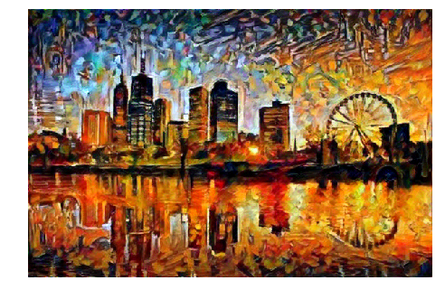
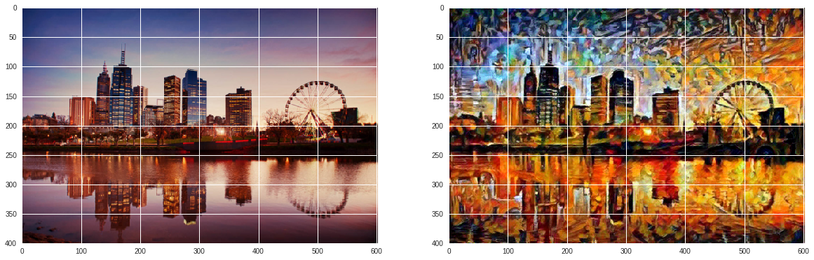

# NeuralStyleTransfer
Transferred the style of an image onto the target image using features of the VGG19 model.

## Content Image
 

  

 

## Style Image
 

  

 

## Target Image (Styled Image)
 

  

 

  

 
